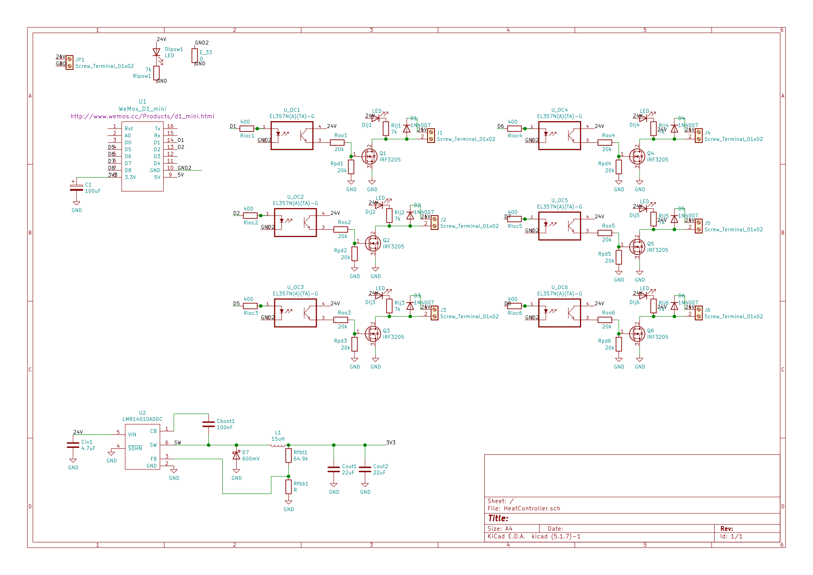
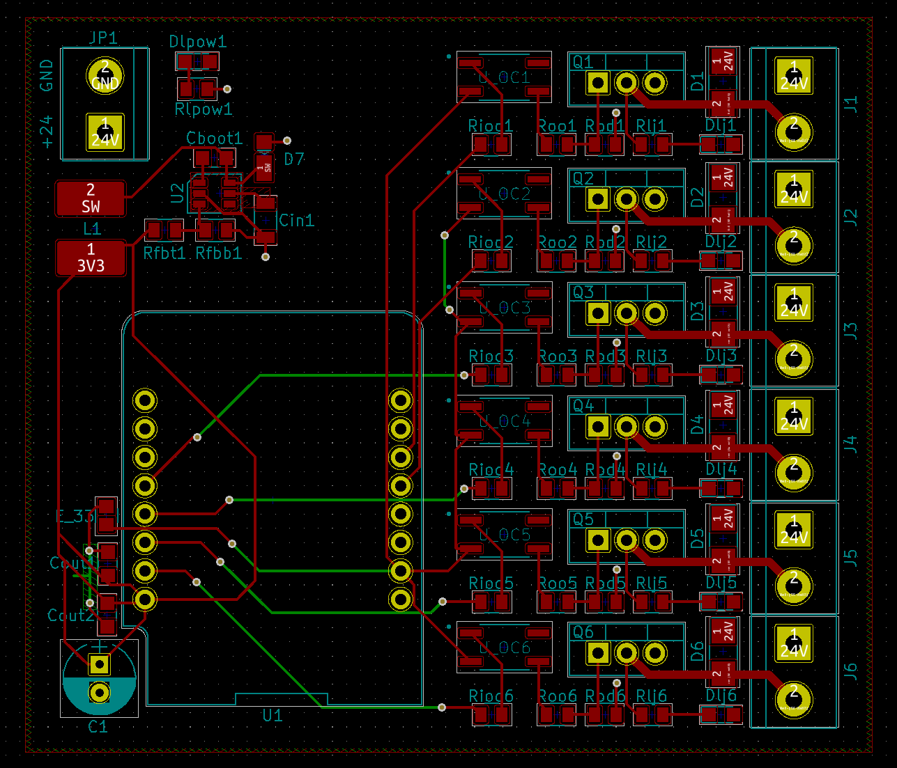
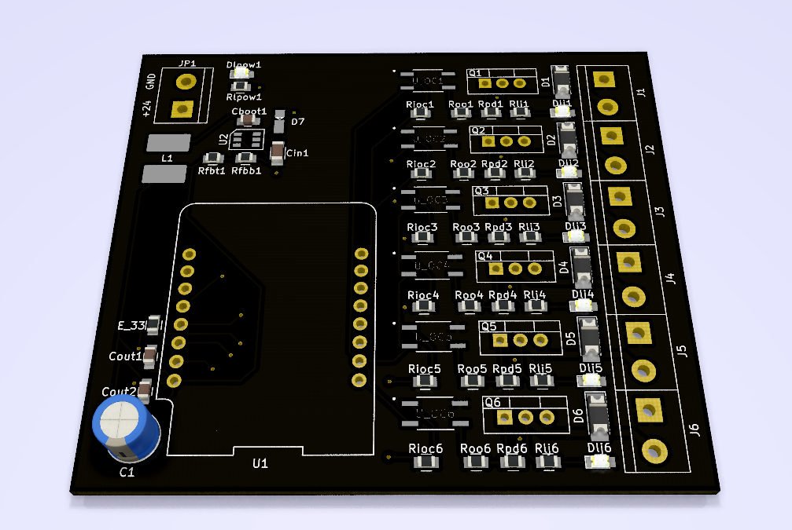
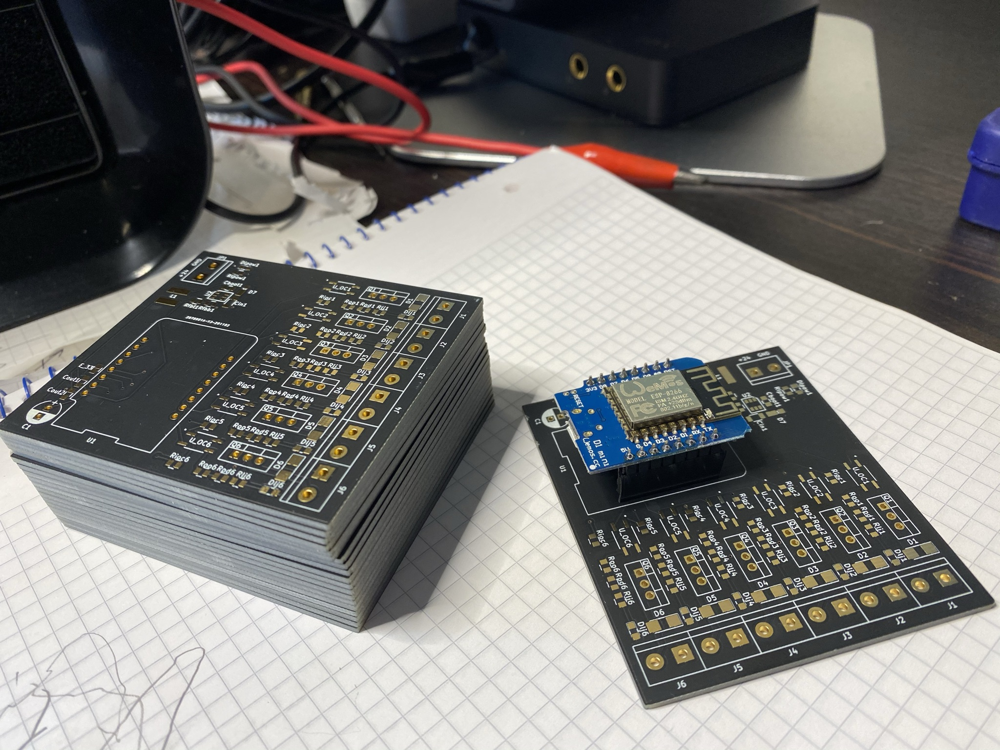
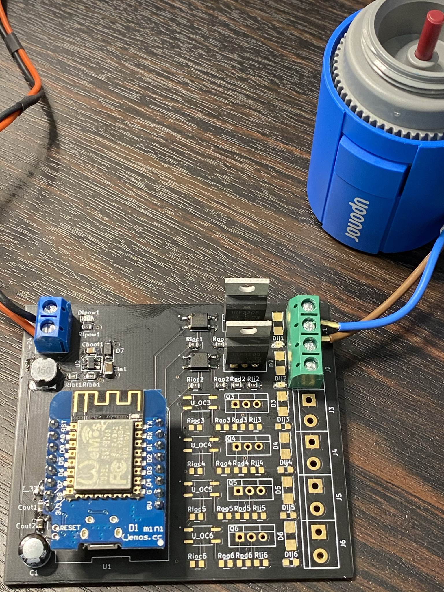

# HeatCon
Simple controller for water based floor heating.
The project was initiated when the old controller for the floor heating in our house broke down. I wanted the ability to control floor heating remotely from mobile and web. A prototype has been up and running for six weeks now without any problems.

## Summary
* Solid state switches (mosfets)
* Optocouplers to isolate MCU from 24V
* ESP8266 socket (WeMos D1 mini)
* Integrated switching power 24V-3.3V, single power for MCU and actuators
* No moving parts (ie no magnetic relays)
* EPS8266 powers opto couplers, mosfets drive the actuators
* Optionally separate ground and power for MCU and actuators
* Should work well for other actuators 6V-30V, up to 2.5A/channel (limited by PCB trace widths, more with thicker Cu)

## Schema

## Layout

## Model

## PCB
PCB by https://jlcpcb.com/, ENIG with black solder mask
  

 

